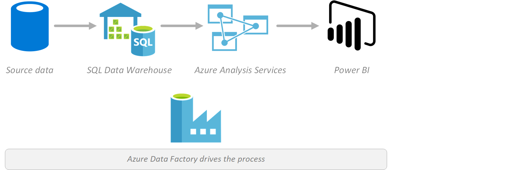

# Business intelligence

Azure offers a rich data and analytics platform so you can build scalable BI and reporting solutions. Create rich, interactive reports with [Power BI](https://docs.microsoft.com/power-bi/) by having it connect to [Azure Analysis Services](https://docs.microsoft.com/en-us/azure/analysis-services/analysis-services-overview/), which uses a highly optimized in-memory engine to provide responses to queries against user-friendly semantic models, within a fraction of a second. The underlying data is provided by [Azure SQL Data Warehouse](https://docs.microsoft.com/azure/sql-data-warehouse/sql-data-warehouse-overview-what-is), which acts as a central repository of integrated data from one or more disparate sources.

## Highlighted services

* [Power BI](https://docs.microsoft.com/power-bi/)
* [Azure Analysis Services](https://docs.microsoft.com/en-us/azure/analysis-services/analysis-services-overview)
* [Azure SQL Data Warehouse](https://docs.microsoft.com/azure/sql-data-warehouse/sql-data-warehouse-overview-what-is)
* [Azure Data Factory](https://docs.microsoft.com/en-us/azure/data-factory/)

## In this guide

* Common Data Architectures
    * [Semantic modeling](../common-architectures/semantic-modeling.md)
    * [Data pipeline](../common-architectures/data-pipeline.md)
* Pipeline Patterns
    * [Data warehousing](../pipeline-patterns/data-warehousing.md)
    * [Online Analytical Processing (OLAP)](../pipeline-patterns/online-analytical-processing.md)
* Technology Choices
    * [Analysis, Visualizations, & Reporting](../technology-choices/analysis-visualizations-reporting.md)
    * [Data warehouses](../technology-choices/data-warehouses.md)
    * [Options for pipeline orchestration, control flow, and data movement](../technology-choices/pipeline-orchestration-data-movement.md)