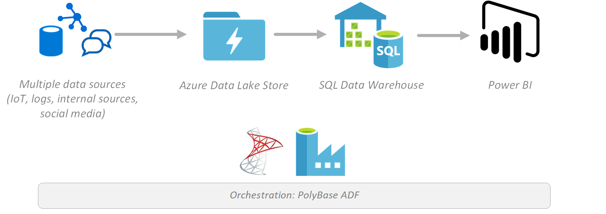

# Data warehousing

Store data coming in from multiple sources into [Azure Data Lake Store](/azure/data-lake-store/data-lake-store-overview), in their native format. [SQL Data Warehouse](/azure/sql-data-warehouse/sql-data-warehouse-overview-what-is) can directly query against the data with a combination of external tables and schema on read capabilities through [PolyBase](/sql/relational-databases/polybase/get-started-with-polybase). Use [Azure Data Factory](/azure/data-factory/) to store the data you need within your warehouse, and quickly analyze and visualize the combined data with [Power BI](/power-bi/).

 
TODO: Change bottom line of diagram to display "Orchestration: PolyBase / ADF" instead.

## Highlighted services

* [Azure Data Lake Store](/azure/data-lake-store/data-lake-store-overview)
* [Azure SQL Data Warehouse](/azure/sql-data-warehouse/sql-data-warehouse-overview-what-is)
* [Azure Data Factory](/azure/data-factory/)
* [PolyBase](/sql/relational-databases/polybase/get-started-with-polybase)
* [Power BI](/power-bi/)

## In this guide

* Common Data Architectures
    * [Semantic modeling](../common-architectures/semantic-modeling.md)
    * [Relational data](../common-architectures/relational-data.md)
* Pipeline Patterns
    * [Data warehousing](../pipeline-patterns/data-warehousing.md)
    * [Online Analytical Processing (OLAP)](../pipeline-patterns/online-analytical-processing.md)
* Technology Choices
    * [Data warehouses](../technology-choices/data-warehouses.md)
    * [Data ingest](../technology-choices/data-ingest.md)
    * [Options for pipeline orchestration, control flow, and data movement](../technology-choices/pipeline-orchestration-data-movement.md)
    * [Data transfer](../technology-choices/data-transfer.md)
    * [Analysis, Visualizations, & Reporting](../technology-choices/analysis-visualizations-reporting.md)
