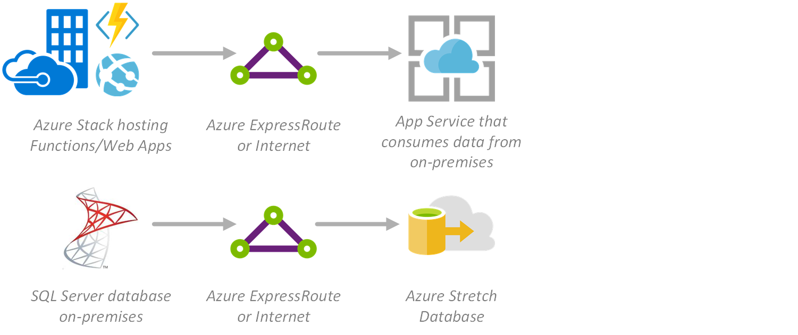

# Hybrid data architecture

When you need hybrid on-premises and cloud options, nothing comes close to Azure. Use [Azure Stack](https://docs.microsoft.com/azure/azure-stack/azure-stack-poc) to deliver Azure services from your own datacenter, using the same tools in both environments for unmatched consistency, allowing you to deploy your data solution to the location that best meets your needs. Use [ExpressRoute](https://docs.microsoft.com/azure/azure-stack/azure-stack-connect-expressroute) for a private, dedicated and high speed connection that extends your on-premises network into Azure. See this example [hybrid reference architecture](https://docs.microsoft.com/en-us/azure/architecture/reference-architectures/hybrid-networking/expressroute-vpn-failover).

## Highlighted services

* [Azure Stack](https://docs.microsoft.com/azure/azure-stack/azure-stack-poc)
* [ExpressRoute](https://docs.microsoft.com/azure/expressroute/expressroute-introduction)
* [Azure App Service](https://docs.microsoft.com/azure/app-service/)
* [SQL Server Stretch Database](https://docs.microsoft.com/azure/sql-server-stretch-database/)

## In this guide

* Common Data Architectures
    * [Relational data](./common-architectures/relational-data.md)
* Pipeline Patterns
    * [Hybrid on-premises and cloud solutions](./pipeline-patterns/hybrid-on-premises-and-cloud.md)
    * [Online Transaction Processing (OLTP)](./pipeline-patterns/online-transaction-processing.md)
* Technology Choices
    * [Online Transaction Processing (OLTP) data stores](./technology-choices/oltp-data-stores.md)
    * [Data transfer](./technology-choices/data-transfer.md)
    * [Data ingest](./technology-choices/data-ingest.md)
