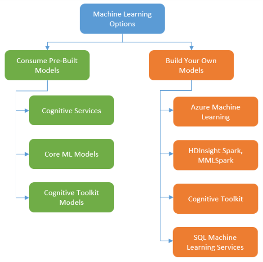
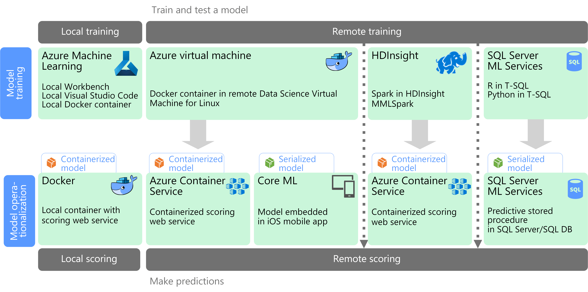

# Machine learning at scale

Machine learning is a technique used to train predictive models based on mathematical algorithms that leverage relationships between data fields to predict unknown values.

The process of creating a deploying machine learning models is an iterative one, in which:
* Data scientists explore the source data to determine relationships between its *features* and the required predicted *labels*.
* The data scientists train and validate models based on appropriate algorithms to find the optimal model for prediction.
* The optimal model is deployed into production&mdash;often as a web service or some other encapsulated function.
* As new data is collected, the model is periodically retrained to improve is effectiveness.

## Model preparation and training
During the model preparation and training phase, data scientists explore the data interactively using languages like Python and R to:
* Extract samples from high volume enterprise data stores.
* Find and treat outliers, duplicates, and missing values to clean the data.
* Determine correlations and relationships in the data through statistical analysis and visualization.
* Apply *feature engineering* techniques to generate new calculated features that improve the predictiveness of statistical relationships.
* Train machine learning models based on predictive algorithms.
* Validate trained models using data that was witheld during training.

To support this interactive analysis and modeling phase, the enterprise ecosystem must enable data scientists to access data using the tools they need to explore it. Additionally, the training of a complex machine learning model can require a lot of intensive processing of high volumes of data, so sufficient resources for scaling out the model training is essential.

## Model deployment and consumption
When a model is ready to be deployed, it can be encapsulated as a web service and deployed in the cloud, to an edge device, or within an enterprise machine learning execution evironment. This deployment process is referred to as operationalization.

## When to use this architecture
Machine learning at scale addresses two different scalability concerns. The first centers around model training, wherein the model needs to be trained against large data sets that require the scale-out capabilities of a cluster to train. The second centers around operationalizating the learned model in a fashion that can scale to meet the scoring requirements of the applications that consume it&mdash;this is typically accomplished by deploying the predictive capabilites as a web service that can then be scaled out. 

## Benefits
Machine learning at scale has the benefit that it can produce powerful, predictive capabilities because better models typically result from more data. Also, because once a model is trained in can be deployed as a stateless, highly-performant, scale-out web service. 

## Challenges
The machine learning at scale approach produces a few challenges:
- You need to have the data, typically a lot of data to train your model, especially for deep learning models.
- You need to have the ability to prepare these big data sets before you can even begin training your model.
- Your model training will need to access the big data stores while training, making it very common to perform the model training using the same big data cluster, such as Spark, that you are using for data prep. 
- For scenarios such as deep learning, not only will you need a cluster that can provide you scale out on CPUs, but your cluster will need to consist of GPU-enabled nodes.   

## Machine learning at scale in Azure
Before deciding on which Machine earning services to utilize in training and operationalization, you should consider if you need to train a model at all or if your requirements are satisfied by using a prebuilt model. In many cases, the use of a prebuilt model is the same as integrating a call to a web service, or using a simple machine learning library to load a saved model and using it as input to the library provided prediction function. As the following diagram illustrates, you can integrate the web services provide by Microsoft Cognitive Services into your application, use the pretrained neural network models provided by Cognitive Toolkit in your application, or embed the serialized models provided by Core ML for your use within your iOS apps. If a prebuilt model does not fit your data or your scenario, then you have multiple options in Azure, including Azure Machine Learning, HDInsight with Spark MLlib and MMLSpark, Cognitive Toolkit, and SQL Machine Learning Services.  

 <!--This image has a lot of unnecessary caps. Really only the first word of any lable should be capped until it's a proper name, like Azure Machine Learning.-->

Once you have decided that a custom model is warranted, then you can begin to design your pipeline from model training to operationalization. In Azure, the options are as follows:

<!--VM should be spelled out as virtual machine.-->

## Technology choices

- [Data science and machine learning](../technology-choices/data-science-and-machine-learning.md)

